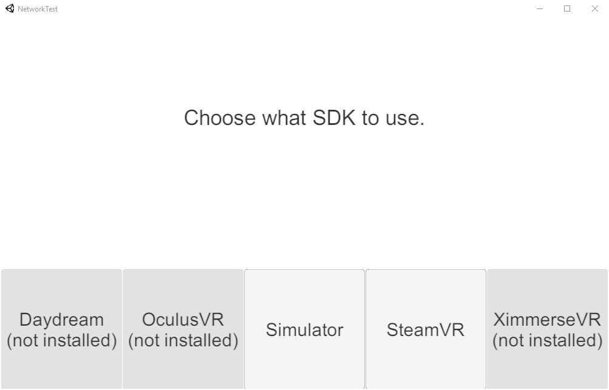

# VRTK-PUN-NetworkTest
A small test project showing how to sync VR CameraRig objects using [Photon's PUN](https://www.photonengine.com/en-US/PUN) and [VRTK](https://github.com/thestonefox/VRTK).

It also includes an example on how to configure VRTK's SDK Manager at runtime:



## Cloning/Downloading this project

This project uses both submodules and symlinks. You can't just download the `.zip` GitHub provides because it won't include the submodules. To clone it properly:

1. Download and install [Git for Windows](https://git-scm.com/download/win). Make sure to install *Git Bash* when asked in the installer and tick the checkbox for *Enable symbolic links*.
2. Run *Git Bash* **as administrator**. Administrator rights are needed to set up the symlinks.
3. `cd` into the folder in which you want to clone the project into, e.g.:

    ```bash
    cd "C:\Users\bddckr\Desktop"
    ```

4. Run the following command to clone the repo into a new folder named *VRTK-PUN-NetworkTest*:

    ```bash
    git clone --recursive -c core.symlinks=true "https://github.com/bddckr/VRTK-PUN-NetworkTest.git" \
    && cd "VRTK-PUN-NetworkTest/" \
    && rm -rf "Assets/Libraries/VRTK" "Assets/Libraries/SteamVR" \
    && git reset --hard HEAD \
    && cd ..
    ```

This will clone the project, set up the submodules and set up the symlinks.

## Set Photon AppId

To be able to use this example project you'll have to set up Photon by specifying the AppId:

1. Open the project in Unity.
2. In the menu bar click on `Window > Photon Unity Networking > Highlight Server Settings`.
3. In the `Inspector` window change the `AppId` field to your own one you got from Photon.
4. Open the scene `TestScene` found in the `Scenes` folder in the `Project` window.
5. Hit Play!

## Testing multiplayer on a single PC

To test multiplayer locally without another computer you can create a standalone build:

1. Either click on `File > Build & Run` or:
    1. In the menu bar click on `File > Build Settings...`.
    2. Click the `Build And Run` button, choose a destination folder and name your executable.
2. Run the build executable.
3. Hit Play in the Editor!

This means you now have two copies of the game running at the same time, one standalone and one in the Editor.

## Unity version info

This project was created with Unity 5.4.4f1 but should work in all the above versions (including the latest beta of 5.6.0), too. Make sure to allow Unity to upgrade the project when you open it.
